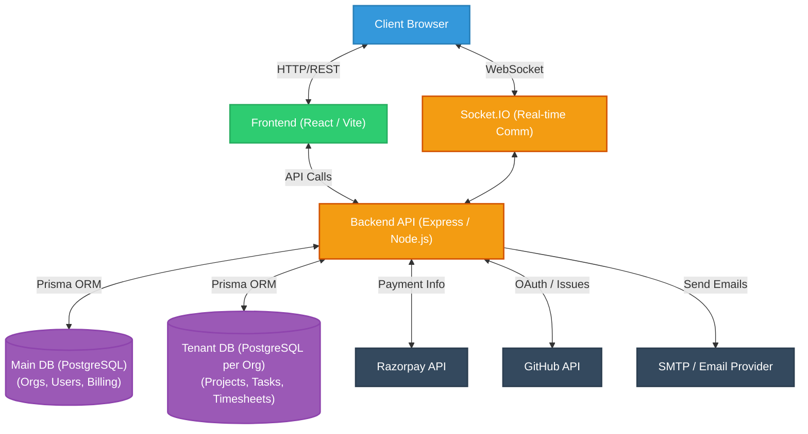
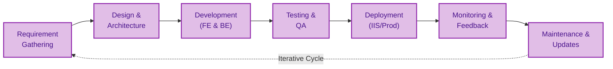

# Section 1: Project Overview

## Project Name
**SSPL-TaskFlow** — SaaS Multi-Project Task & Progress Management Platform

---

## Introduction
SSPL-TaskFlow is a comprehensive full-stack SaaS (Software as a Service) platform designed for companies to manage multiple projects, visualize progress, track team performance, and export professional dashboards for client meetings. Built with a modern, high-performance tech stack, it provides organizations with the necessary tools to streamline their workflows, enhance collaboration, and deliver exceptional results.

---

## Purpose
The primary purpose of SSPL-TaskFlow is to enable organizations to efficiently manage projects, tasks, timesheets, team performance, and client communication through a unified platform. It focuses heavily on visual reporting and presentation-ready interfaces, bridging the gap between internal project execution and client-facing updates.

---

## Problem Statement
Modern organizations often struggle with fragmented project management tools, leading to a lack of cohesive visual reporting for clients, poor workload visibility among teams, and inefficient manual timesheet tracking. This fragmentation results in miscommunication, delayed deliveries, and administrative overhead. SSPL-TaskFlow aims to solve these pain points by centralizing these essential business operations into one seamless platform.

---

## Goals
- **Centralized Multi-Project Management:** Manage multiple projects seamlessly from a single dashboard.
- **Visual, Presentation-Ready Dashboards:** Generate comprehensive, easily understandable visualizations for stakeholders.
- **Role-Based Access Control:** Secure the platform with granular permissions tailored to different organizational roles.
- **Real-Time Team Collaboration:** Foster seamless communication via integrated chat and live updates.
- **Time Tracking and Performance Analytics:** Accurately log time and evaluate team KPIs.
- **Budget Monitoring:** Keep project finances in check with real-time tracking and alerts.
- **Client-Facing Project Views:** Provide clients with transparent, view-only progress dashboards.
- **GitHub Integration:** Sync code repositories, commits, and issues directly with project tasks.
- **Subscription-Based SaaS Model:** Offer flexible, tiered billing plans managed via Razorpay.

---

## Target Users
- **Super Admins:** Responsible for platform-wide management, global settings, and managing tenant subscriptions.
- **Organization Admins:** Have full control over their specific organization, including billing, user management, and global project settings.
- **Project Managers:** Focus on managing specific projects, allocating resources, assigning tasks, and monitoring team progress.
- **Team Members:** Execute assigned tasks, collaborate with peers, and log their time via timesheets or live timers.
- **Clients:** Access view-only project dashboards to track the progress of their respective projects without interfering with operations.

---

## Key Features
1. **Multi-Tenant Architecture:** Employs dedicated databases per organization to ensure data isolation, security, and scalability.
2. **Visual Dashboards:** Utilizes Recharts to deliver dynamic pie, bar, and area charts for comprehensive data visualization.
3. **Multi-Project Management:** Supports a structured 5-phase lifecycle: `Planning` → `Design` → `Development` → `Testing` → `Deployment`.
4. **Advanced Task Management:** Features subtasks, comments, attachments, tags, and an interactive Kanban board for agile workflows.
5. **Role-Based Access Control (RBAC):** Distinct roles including `SUPERADMIN`, `ADMIN`, `MANAGER`, `MEMBER`, and `CLIENT` ensure proper authorization.
6. **Budget Tracking:** Integrates color-coded alerts to warn managers as projects approach their budget thresholds.
7. **Timesheet Management:** Offers both timer-based tracking and manual entry, coupled with a robust approval workflow.
8. **Real-time Chat:** Powered by Socket.IO, featuring emoji reactions, direct messages (DMs), and group conversations.
9. **Team Performance Analytics:** Tracks Key Performance Indicators (KPIs) and visualizes performance trends over time.
10. **GitHub Integration:** Includes OAuth setup, repository linking, and issue importing for a unified developer experience.
11. **PDF/PNG Export:** Uses Puppeteer to generate high-quality exports tailored for presentation mode during client meetings.
12. **Razorpay Payment Integration:** Manages subscription plans (`FREE`, `STARTER`, `PRO`, `ENTERPRISE`) securely and efficiently.
13. **Support Ticket System:** Integrated helpdesk for resolving organizational and technical queries.
14. **Notification System:** Delivers real-time in-app alerts and email notifications via Nodemailer.
15. **Excel Import/Export:** Facilitates easy bulk data management for projects, tasks, users, and timesheets via Excel files.
16. **Activity Logging and Audit Trail:** Maintains detailed logs of platform activities for security and compliance tracking.

---

## Technology Stack

| Layer | Technology | Version | Purpose |
|-------|-----------|---------|----------|
| **Frontend** | React | 18 | Core UI library for building dynamic interfaces |
| | Vite | 5 | Next-generation frontend tooling and bundler |
| | Tailwind CSS | 3.4 | Utility-first CSS framework for rapid styling |
| | shadcn/ui | - | Radix UI primitives for accessible, customizable components |
| | Recharts | 2.10 | Composable charting library for React |
| | Zustand | 4.4 | Small, fast, and scalable state management |
| | React Router | 6.22 | Declarative routing for React applications |
| | Socket.IO Client | 4.8 | Client-side library for real-time bidirectional event-based communication |
| | @dnd-kit | - | Lightweight, modular, accessible drag-and-drop toolkit |
| | CKEditor 5 | - | Rich text editor for robust content formatting |
| | html2canvas / html2pdf.js | - | Libraries for generating client-side PDF and image exports |
| | date-fns | - | Modern JavaScript date utility library |
| | lucide-react | - | Beautiful & consistent icon toolkit |
| | Emoji Picker React | - | Emoji selector for chat and comments |
| | xlsx | - | Parser and writer for Excel spreadsheet data |
| **Backend** | Node.js | 18+ | JavaScript runtime for scalable network applications |
| | Express | 4.18 | Fast, unopinionated, minimalist web framework for Node.js |
| | Prisma ORM | 5.22 | Next-generation ORM for Node.js and TypeScript |
| | JWT (jsonwebtoken) | 9.0 | Industry standard for representing claims securely between two parties |
| | bcryptjs | 3.0 | Optimized bcrypt in JavaScript for password hashing |
| | Socket.IO | 4.8 | Server-side real-time communication |
| | Puppeteer | 21.11 | Headless Chrome Node.js API for server-side PDF generation |
| | Razorpay SDK | 2.9 | Payment gateway integration for SaaS subscriptions |
| | Nodemailer | 8.0 | Module for Node.js applications to allow easy email sending |
| | @octokit/rest | 22.0 | GitHub REST API client for Node.js |
| | node-cron | 4.5 | Task scheduler in pure JavaScript for Node.js |
| | multer | 2.1 | Middleware for handling `multipart/form-data` (file uploads) |
| | swagger-jsdoc/swagger-ui-express | - | API documentation generation and UI |
| | uuid / otplib / qrcode | - | Utilities for unique IDs and two-factor authentication |
| **Database** | PostgreSQL | 14+ | Powerful, open source object-relational database system |
| | Prisma ORM Schema | - | Dual schema implementation (Main DB + Tenant DB) |
| **Deployment** | IIS with iisnode | - | Hosting Node.js applications on Windows Server |
| | PowerShell | - | Automated setup and deployment scripts |

---

## High-Level Architecture



---

## Folder Structure

```text
SSPL-TaskFlow-main/
├── backend/
│   ├── prisma/
│   │   ├── schema.prisma          # Main DB schema (orgs, users, billing)
│   │   ├── seed.js                # Demo data seeder
│   │   └── tenant/
│   │       └── schema.prisma      # Tenant DB schema (projects, tasks, etc.)
│   ├── src/
│   │   ├── controllers/           # 20 controller files
│   │   ├── middleware/            # auth, tenant, error, feature gate, permissions
│   │   ├── routes/                # 19 route files
│   │   ├── services/              # email, tenant provisioning, cron
│   │   ├── config/                # database, razorpay config
│   │   ├── utils/                 # helper utilities
│   │   ├── lib/                   # Prisma client singleton
│   │   └── server.js              # Express app entry + Socket.IO
│   ├── uploads/                   # File uploads (avatars, attachments, logos)
│   └── package.json
├── frontend/
│   ├── src/
│   │   ├── components/            # Reusable UI components
│   │   │   ├── ui/               # shadcn/ui primitives (28 components)
│   │   │   ├── forms/            # TaskForm, ProjectForm
│   │   │   ├── kanban/           # KanbanColumn, KanbanCard
│   │   │   ├── task/             # TaskCard, TaskDetail, TaskFilters
│   │   │   ├── layout/           # Sidebar, Header
│   │   │   ├── Layout.jsx        # Main app shell
│   │   │   ├── Chat.jsx          # Chat widget
│   │   │   ├── GlobalTimer.jsx   # Time tracking timer
│   │   │   ├── NotificationBell.jsx
│   │   │   └── ... (16 components)
│   │   ├── pages/                # 21 page components
│   │   │   ├── organization/     # Org management pages
│   │   │   └── tickets/          # Ticket pages
│   │   ├── store/                # 5 Zustand stores
│   │   ├── lib/                  # api.js, utils.js
│   │   ├── superadmin/           # Super admin panel (9 components)
│   │   ├── App.jsx               # Router + auth logic
│   │   └── main.jsx              # Entry point
│   ├── tailwind.config.js
│   ├── vite.config.js
│   └── package.json
├── setup.ps1                      # Automated setup script
├── API.md
├── FEATURES.md
├── SETUP.md
└── README.md
```

---

## Project Workflow


