# Section 2: Business Flow

This document details the business flow of the SSPL-TaskFlow platform, outlining the various actors, comprehensive user journeys, feature-specific workflows, underlying business rules, and exception handling mechanisms.

---

## 1. Actors

The system is accessed by various roles, each with specific permissions and workflows.

| Role | Description | Key Responsibilities & Capabilities |
| :--- | :--- | :--- |
| **Super Admin** | Platform Owner | Manages all organizations, global billing, system settings, user impersonation, and monitors system health. |
| **Organization Admin** | Tenant Owner | Creates org during signup. Full control over org settings, team, projects. Can invite users, manage roles, and configure features. |
| **Project Manager** | Project Lead | Creates and manages projects, assigns tasks, tracks phases, manages team workload, and approves timesheets. |
| **Team Member** | Worker | Works on assigned tasks, logs time, participates in chat, updates task progress, and views performance metrics. |
| **Client** | External Stakeholder| View-only access to specific project dashboards, tracks milestones, and can create support tickets. |

---

## 2. User Journeys

### 2.1. Onboarding Journey
The typical flow for a new organization signing up on the platform.

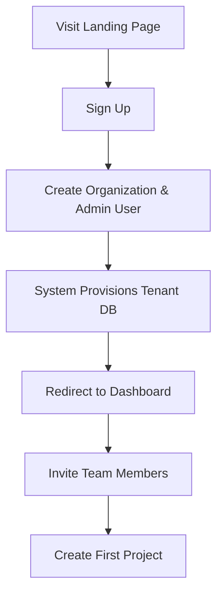

### 2.2. Project Manager Journey
The day-to-day operations of a project manager overseeing execution.

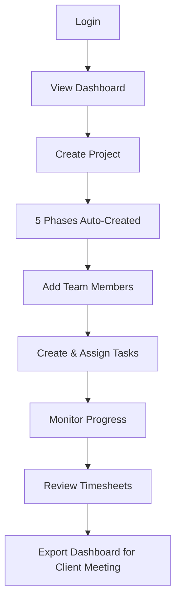

### 2.3. Team Member Journey
The workflow for users executing the actual project tasks.

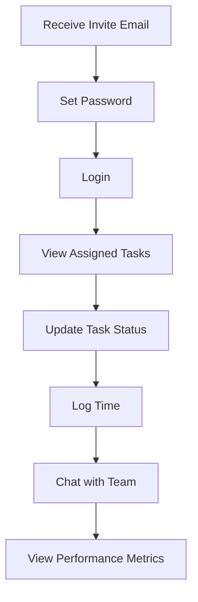

### 2.4. Client Journey
How external stakeholders interact with the platform.

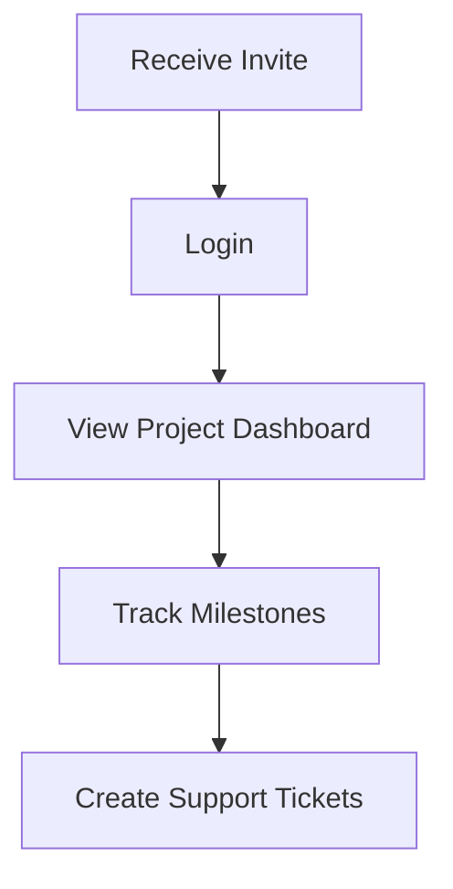

### 2.5. Super Admin Journey
Platform administration and global monitoring.

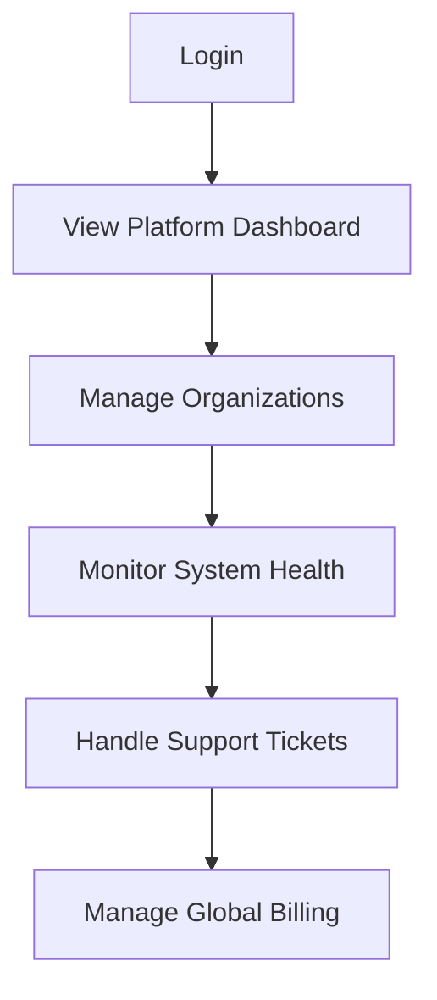

---

## 3. Feature Workflows

### 3.1. Project Lifecycle Flow
Projects follow a structured lifecycle divided into phases. Each phase transitions through specific states, which are auto-calculated based on task completion.

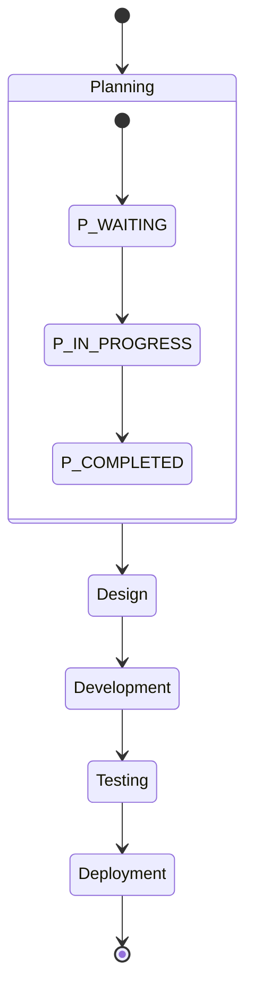

### 3.2. Task Lifecycle Flow
Tasks are the atomic units of work in the system. They support subtasks, comments, attachments, and tags.

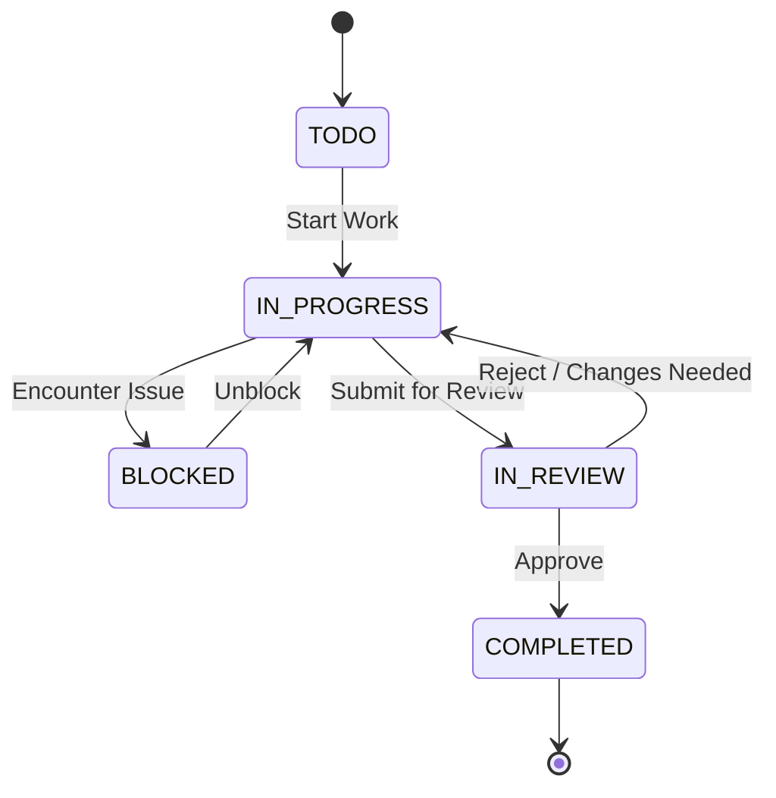

### 3.3. Timesheet Workflow
Time logged by team members undergoes an approval process by the project manager.

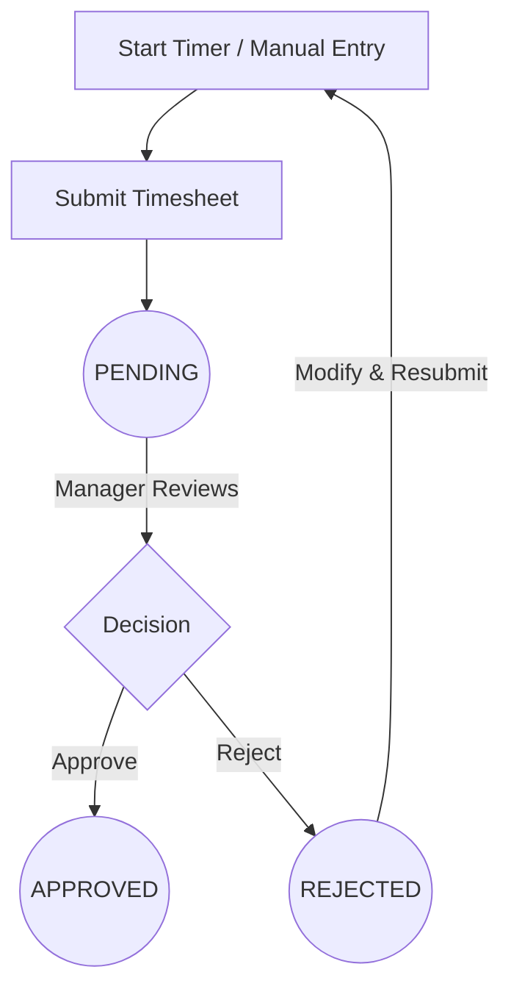

### 3.4. Billing/Subscription Flow
Organizations can upgrade their plans to unlock features and capacities.

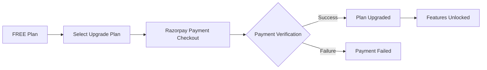
*Available Plans: FREE (10 users, 5 projects), STARTER, PRO, ENTERPRISE.*

### 3.5. GitHub Integration Flow
Seamless synchronization of GitHub issues into platform tasks.

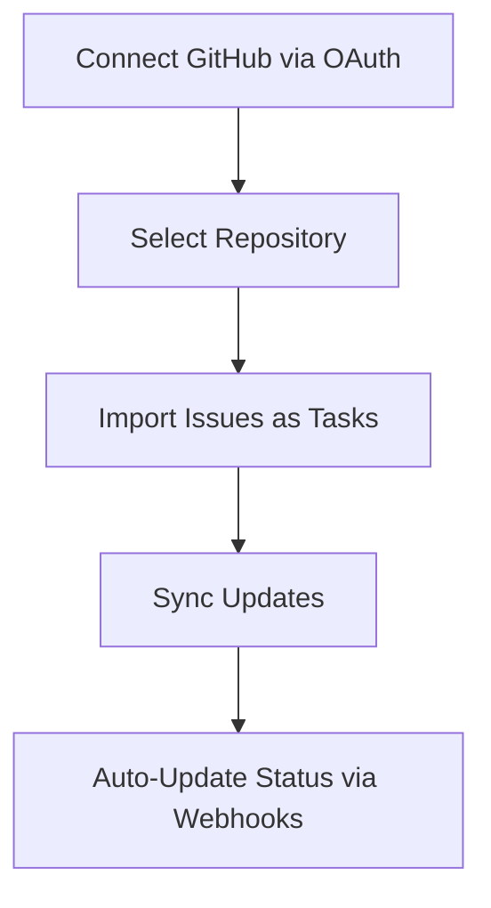

---

## 4. Business Rules

The following core rules govern the logic of the SSPL-TaskFlow platform:

1. **Tenant Isolation:** Each signup creates a new Organization with a dedicated tenant database to guarantee data isolation.
2. **Authorization:** Only users with `ADMIN` or `MANAGER` roles can create projects and invite new users.
3. **Project Structure:** Newly created projects automatically receive exactly 5 default phases in a fixed order (Planning, Design, Development, Testing, Deployment).
4. **Task Assignment:** Tasks must belong to a project and, optionally, to a specific phase within that project.
5. **Client Access:** Users with the `CLIENT` role are strictly restricted to read-only access for assigned projects.
6. **Budget Alerts:** Project budgets generate alerts based on consumption thresholds:
   - Green: `< 75%` utilized
   - Yellow: `75% - 90%` utilized
   - Red: `> 90%` utilized
7. **Overdue Status:** Any task that passes its due date without being in the `COMPLETED` state is automatically marked as overdue.
8. **Timesheet Approvals:** Timesheets require explicit manager approval before they are finalized and factored into billing or budget metrics.
9. **Feature Gating:** Access to premium modules is gated by the organization's active subscription plan.
10. **Data Privacy:** Organization data is completely isolated via separate databases, preventing accidental cross-tenant data leakage.

---

## 5. End-to-End Flow

The sequence diagram below illustrates the comprehensive request flow through the system's architecture, highlighting the multi-tenant middleware approach.

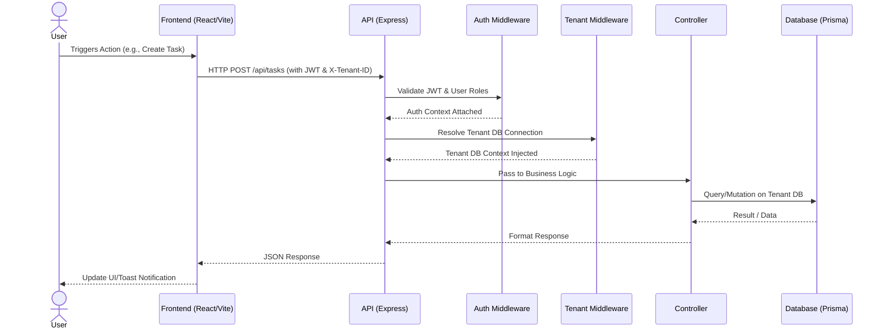

---

## 6. Exceptions

The system anticipates several exceptional states and routes users accordingly to maintain security and operational integrity.

| Exception State | Trigger | System Behavior |
| :--- | :--- | :--- |
| **Suspended Organization** | Non-payment, violation of terms | Users are restricted from logging in and see a suspension notice. |
| **Trial Expired** | 14-day free trial ends | Limited functionality; Org Admins receive an upgrade prompt. |
| **Feature Not in Plan** | Accessing a gated feature (e.g., Advanced Reports) | User is redirected to a `RestrictedAccess` page detailing required plans. |
| **Unapproved User** | Self-signup waiting for admin approval | Redirected to `PendingApproval` page upon login attempt. |
| **Must Change Password** | First login from an invite link | Redirected to `SetPassword` page to establish credentials before dashboard access. |
