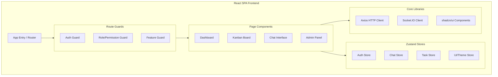
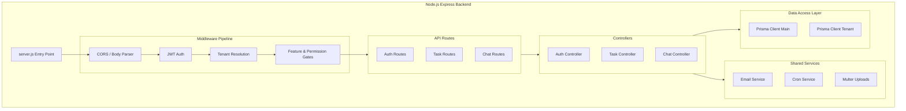
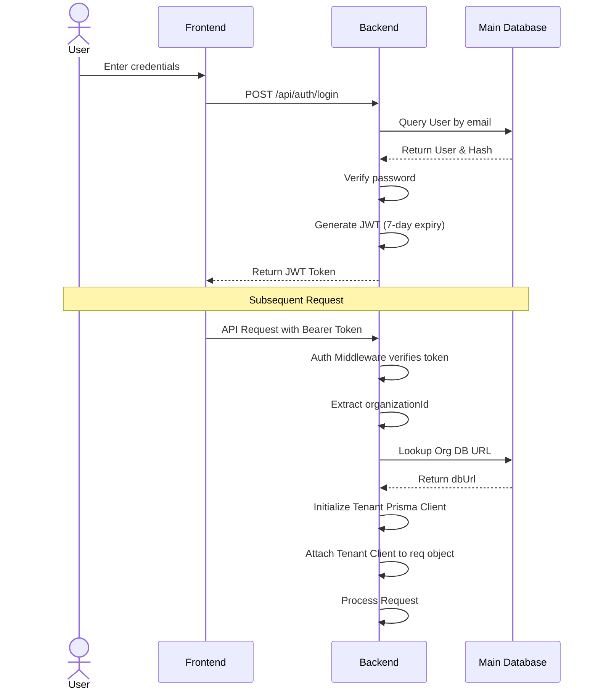
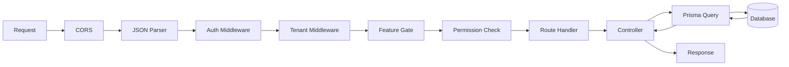
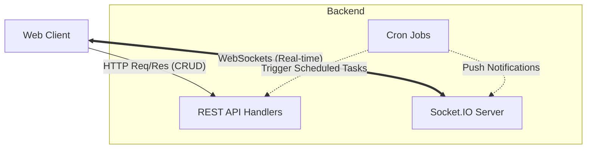

# 3. System Architecture

This section details the architectural design of the SSPL-TaskFlow platform, which follows a multi-tenant SaaS model with dedicated databases per tenant.

## Overall Architecture

The application is structured into four main tiers: Frontend, Backend, Database, and External Services. It uses a database-per-tenant architecture to ensure strong data isolation between organizations.

- **Frontend**: React SPA (Vite build) served via IIS.
- **Backend**: Node.js/Express REST API with Socket.IO for real-time capabilities.
- **Main Database**: PostgreSQL - stores global data like organizations, users (auth), billing, notifications, activity logs, platform settings, and integrations.
- **Tenant Databases**: Separate PostgreSQL database per organization - stores tenant-specific data including projects, tasks, phases, employees, timesheets, chat, worklogs, and workloads.
- **External Services**: Razorpay (payments), GitHub API (integration), and SMTP (emails).

```mermaid
flowchart TD
    %% Users
    Client[Web Browser]

    %% External Services
    subgraph External[External Services]
        Razorpay[Razorpay API]
        GitHub[GitHub API]
        SMTP[SMTP Server]
    end

    %% IIS Server
    subgraph IIS[IIS Web Server]
        Static[Static Files\nFrontend Build]
        NodeApp[iisnode\nBackend Server]
    end

    %% Databases
    subgraph DB[Database Tier]
        MainDB[(Main PostgreSQL DB)]
        subgraph Tenants[Tenant Databases]
            Tenant1[(Tenant 1 DB)]
            Tenant2[(Tenant 2 DB)]
            TenantN[(Tenant N DB)]
        end
    end

    Client <-->|HTTPS| IIS
    Client <-->|WSS (Socket.IO)| NodeApp
    
    NodeApp <--> MainDB
    NodeApp <--> Tenants
    
    NodeApp <-->|Payments| Razorpay
    NodeApp <-->|Code Sync| GitHub
    NodeApp -->|Emails| SMTP
```

## Frontend Architecture

The frontend is a single-page application built with modern React tools and patterns.

- **Framework**: React 18 with Vite 5 bundler
- **Routing**: React Router 6 with lazy loading and route guards (SuperAdminGuard, FeatureGuard, PermissionGuard)
- **State Management**: Zustand stores (authStore, chatStore, headerStore, notificationStore, timerStore)
- **UI Library**: shadcn/ui (Radix UI primitives) with 28 components
- **Styling**: Tailwind CSS 3.4 with custom theme
- **Data Visualization**: Recharts (pie, bar, area, line charts)
- **Real-time**: Socket.IO Client for chat and notifications
- **Drag & Drop**: @dnd-kit for Kanban board
- **Rich Text**: CKEditor 5 for chat messages
- **Export**: html2canvas + html2pdf.js for dashboard export



## Backend Architecture

The backend is a Node.js RESTful API using Express, organized into logical layers.

- **Framework**: Express 4.18 with ES modules
- **Entry Point**: `server.js` - Express setup, Socket.IO, route mounting, cron initialization
- **Controllers**: 20 controllers handling business logic
- **Routes**: 19 route files with middleware chains
- **Middleware Stack**: auth → tenantMiddleware → authorize/featureGate/permissionCheck
- **Services**: emailService (Nodemailer), tenantService (DB provisioning), cronService (scheduled tasks)
- **File Upload**: Multer with disk storage in `/uploads`
- **API Documentation**: Swagger via swagger-jsdoc + swagger-ui-express at `/api-docs`
- **Report Generation**: Puppeteer (headless Chrome) for PDF/PNG



## Database Architecture

The system employs a separate database per tenant to ensure data security and isolation.

### Main Database Schema (schema.prisma)

Stores platform-wide configuration, billing, and user authentication.

- **Models**: Organization, User, Notification, Invoice, PlatformSetting, ActivityLog, Integration
- **Enums**: Role (SUPERADMIN, ADMIN, MANAGER, MEMBER, CLIENT), OrgPlan (FREE, STARTER, PRO, ENTERPRISE), OrgStatus (TRIAL, ACTIVE, SUSPENDED, PENDING), InvoiceStatus, DbStrategy

```mermaid
erDiagram
    Organization ||--o{ User : "has"
    Organization ||--o{ Invoice : "billed via"
    Organization ||--o{ Integration : "configures"
    Organization ||--o{ ActivityLog : "generates"
    User ||--o{ Notification : "receives"
    
    Organization {
        string id PK
        string name
        string slug
        string dbUrl
        enum plan OrgPlan
        enum status OrgStatus
    }
    
    User {
        string id PK
        string email
        string password
        enum role Role
        string organizationId FK
    }
```

### Tenant Database Schema (tenant/schema.prisma)

Each organization has a dedicated database initialized with this schema.

- **Models**: Employee, Project, Phase, Task, TaskComment, TaskAttachment, ProjectMember, Workload, Timesheet, ActiveTimer, Worklog, Conversation, ConversationParticipant, Message, MessageRead
- **Project statuses**: PLANNING, ACTIVE, ON_HOLD, COMPLETED, CANCELLED
- **Phase statuses**: WAITING, IN_PROGRESS, COMPLETED
- **Task statuses**: TODO, IN_PROGRESS, IN_REVIEW, COMPLETED, BLOCKED
- **Task priorities**: LOW, MEDIUM, HIGH, URGENT

```mermaid
erDiagram
    Employee ||--o{ ProjectMember : "is part of"
    Employee ||--o{ Task : "assigned to"
    Employee ||--o{ Timesheet : "logs"
    Project ||--o{ Phase : "divided into"
    Project ||--o{ ProjectMember : "has"
    Phase ||--o{ Task : "contains"
    Task ||--o{ TaskComment : "has"
    Task ||--o{ TaskAttachment : "has"
    
    Project {
        string id PK
        string name
        enum status ProjectStatus
    }
    
    Phase {
        string id PK
        string name
        string projectId FK
        enum status PhaseStatus
    }
    
    Task {
        string id PK
        string title
        string phaseId FK
        string assigneeId FK
        enum status TaskStatus
        enum priority TaskPriority
    }
```

## Third-Party Services

| Service | Purpose | Integration Method |
|---------|---------|-------------------|
| Razorpay | Payment processing | Server-side SDK, order creation + payment verification |
| GitHub | Code repository integration | OAuth 2.0, `@octokit/rest` SDK |
| SMTP | Email notifications | Nodemailer, configurable SMTP server |
| Puppeteer | PDF/PNG report generation | Headless Chrome, server-side rendering |

## Authentication Flow



## Data Flow

The following diagram outlines the standard pipeline for processing an API request:



## Communication Between Components

- **REST API**: Standard HTTP request/response cycle for CRUD operations.
- **WebSocket (Socket.IO)**: Persistent bi-directional connections for real-time chat messages, typing indicators, read receipts, notifications, and live dashboard updates.
- **Cron Jobs**: Background tasks scheduled via `node-cron` (e.g., overdue task checks, trial expiration monitoring, daily timesheet summaries).


