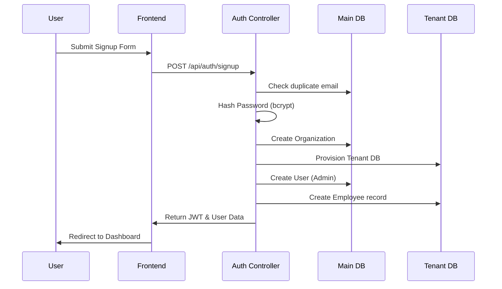
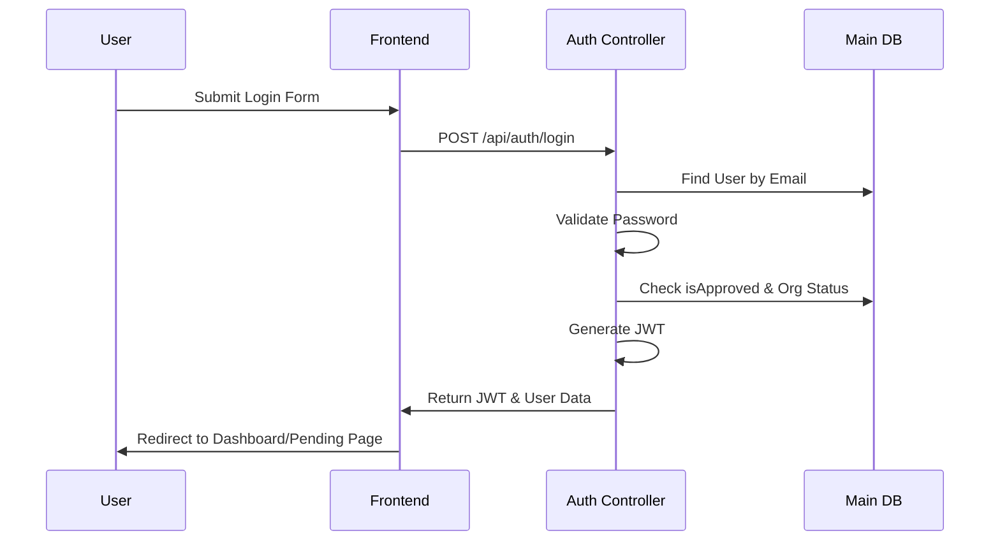

# Module: Authentication & User Management

## Purpose
Handles user registration, login, password management, team invitations, and user approval workflows in the SSPL-TaskFlow platform.

## Features
- **Self-service signup**: Creates an organization, an admin user, and provisions a dedicated tenant database.
- **JWT-based login**: Secure authentication with a 7-day token expiry.
- **Team member invitation**: Allows Admin/Manager roles to invite new users to the organization.
- **Password management**: 
  - Forced password set for invited users (`mustChangePassword` flow).
  - Forgot/Reset password via secure email token.
  - Change password for authenticated users.
- **User approval workflow**: Organizations can enable a `requireApproval` setting requiring admins to approve new signups.
- **User activation**: Ability to activate or deactivate user accounts.
- **Bulk operations**: Bulk user invite functionality.
- **Profile management**: Users can manage their profiles and upload avatars.
- **Role management**: Support for multiple roles (`SUPERADMIN`, `ADMIN`, `MANAGER`, `MEMBER`, `CLIENT`).

## Business Logic
- **Signup**: Validates input fields → checks for duplicate email → hashes the password using bcrypt (10 salt rounds) → creates the Organization in the main DB → provisions the tenant DB → creates the User in the main DB → creates a mirrored Employee record in the tenant DB → generates a JWT.
- **Login**: Finds the user by email → validates the password hash → checks `isApproved` status → verifies the organization is not suspended → generates a JWT containing `{ id, email, role, organizationId }`.
- **Invite**: Restricted to `ADMIN`/`MANAGER` → creates a new user with a temporary password → sets `isApproved=true` and `mustChangePassword=true` → creates a mirrored tenant Employee record → sends an invitation email.
- **Approval**: Restricted to `ADMIN` → toggles the `isApproved` field for pending users.

## User Flow

### Signup Flow


### Login Flow


## Frontend Components
- **Login form**: Located in `App.jsx`. Handles authentication and token storage.
- **Signup form**: Located in `App.jsx`. Handles registration and initial setup.
- **SetPassword page**: Flow for invited users to set their initial password.
- **ForgotPassword page**: Initiates the password reset process.
- **ResetPassword page**: Completes the password reset process using an email token.
- **PendingApproval page**: Displayed to users awaiting admin approval.
- **Team.jsx**: Interface for user management, inviting members, and role changes.
- **Settings.jsx**: Interface for profile management and password changes.

## Backend Services
- **authController.js**: Core authentication logic including `signup`, `login`, `getMe`, `inviteUser`, `setPassword`, `forgotPassword`, `resetPassword`, `changePassword`, `approveUser`, `rejectUser`.
- **userController.js**: User management logic including `getUsers`, `getUser`, `updateUser`, `deleteUser`, `updateRole`, `uploadAvatar`, `getPendingUsers`, `activateUser`, `deactivateUser`, `bulkInviteUsers`.
- **emailService.js**: Utility for sending emails (`sendInviteEmail`, `sendPasswordResetEmail`).

## Database Tables

### Main DB: `User`
| Column | Type | Description |
|--------|------|-------------|
| id | String (UUID) | Primary Key |
| email | String | Unique identifier |
| name | String | User's full name |
| passwordHash | String | Bcrypt hashed password |
| role | Enum | User role (e.g., ADMIN, MEMBER) |
| isApproved | Boolean | Approval status |
| mustChangePassword | Boolean | Flag for forced password change |
| resetToken | String | Token for password reset |
| resetTokenExpiry | DateTime | Expiry for reset token |
| organizationId | String | Foreign key to Organization |

### Tenant DB: `Employee`
| Column | Type | Description |
|--------|------|-------------|
| id | String (UUID) | Primary Key |
| userId | String | Reference to Main DB User ID |
| name | String | Employee name |
| email | String | Employee email |
| role | Enum | Employee role |
| avatar | String | Avatar URL |
| designation | String | Job title |
| department | String | Department name |
| phone | String | Contact number |
| address | String | Physical address |
| joiningDate | DateTime | Date of joining |
| isActive | Boolean | Account active status |

## APIs Used

### Authentication Endpoints

| Method | Path | Auth Required | Description |
|--------|------|---------------|-------------|
| POST | `/api/auth/signup` | No | Register a new organization and admin user |
| POST | `/api/auth/login` | No | Authenticate and retrieve JWT |
| GET | `/api/auth/me` | Yes | Retrieve current authenticated user profile |
| POST | `/api/auth/invite` | Yes (Admin/Manager) | Invite a new team member |
| POST | `/api/auth/set-password` | No | Set initial password for invited users |
| POST | `/api/auth/forgot-password` | No | Request a password reset link |
| POST | `/api/auth/reset-password` | No | Reset password using token |
| POST | `/api/auth/change-password` | Yes | Change password for logged-in user |
| POST | `/api/auth/approve/:userId` | Yes (Admin) | Approve a pending user |
| POST | `/api/auth/reject/:userId` | Yes (Admin) | Reject a pending user |

#### Example: POST /api/auth/login
**Request:**
```json
{
  "email": "user@example.com",
  "password": "securepassword123"
}
```
**Response (200 OK):**
```json
{
  "success": true,
  "token": "eyJhbGciOiJIUzI1NiIsInR5c...",
  "user": {
    "id": "123",
    "email": "user@example.com",
    "role": "ADMIN",
    "organizationId": "456"
  }
}
```

## Validation Rules
- **Email**: Must be a valid email format and unique within the system.
- **Password**: Minimum length of 6 characters.
- **Name**: Required and must be non-empty.
- **Role**: Must be a valid enum value (`SUPERADMIN`, `ADMIN`, `MANAGER`, `MEMBER`, `CLIENT`).

## Security Considerations
- **Password Hashing**: All passwords are securely hashed using bcrypt with 10 salt rounds.
- **Session Management**: Stateless JWT authentication with a 7-day expiration.
- **Token Security**: Password reset tokens have a strict expiration time (e.g., 1 hour).
- **Authorization**: Role-based access control (RBAC) is implemented via route protection middlewares.
