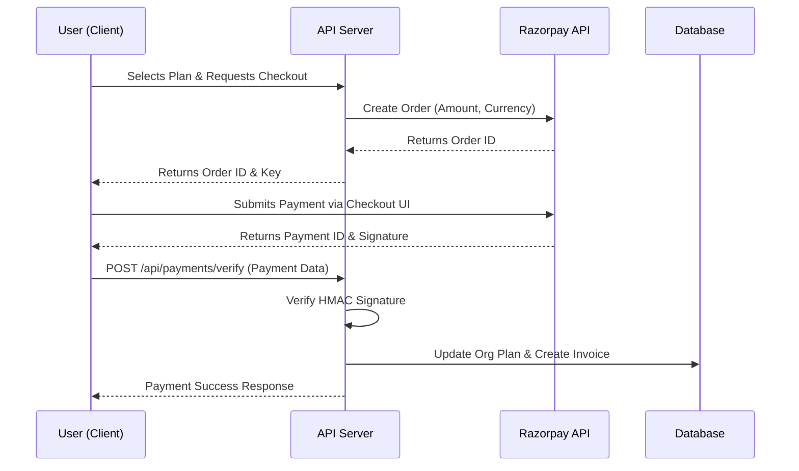

# Billing & Payments Module

## Overview
The Billing & Payments module handles subscription management, feature gating, and payment processing for organizations within SSPL-TaskFlow. It integrates with Razorpay to securely process transactions and automates invoice generation.

## Features
*   **Subscription Plans:** Tiered access with FREE, STARTER, PRO, and ENTERPRISE plans.
*   **Plan Limits:** Enforces maximum limits on users, projects, and specific features based on the active plan.
*   **Payment Gateway:** Integrated with Razorpay for seamless and secure payment processing.
*   **Order Management:** Secure order creation and payment verification using HMAC signatures.
*   **Invoicing:** Automated invoice generation and management.
*   **History:** Users can view their complete invoice and payment history.
*   **Plan Management:** Self-service UI for upgrading or downgrading plans.
*   **Feature Gating:** Middleware to restrict access to premium features based on the organization's current plan.

## Plan Details

| Plan | Max Users | Max Projects | Features |
| :--- | :--- | :--- | :--- |
| **FREE** | 10 | 5 | Basic task management, standard chat |
| **STARTER** | 50 | 20 | Advanced reporting, priority support |
| **PRO** | 200 | Unlimited | Custom workflows, API access, integrations |
| **ENTERPRISE** | Unlimited | Unlimited | Dedicated support, custom SLA, SSO |

*Note: Feature limits are enforced dynamically via backend middleware.*

## System Architecture

### Backend Components
*   **Controllers:**
    *   `paymentController.js`: Manages `createOrder`, `verifyPayment`, `getPaymentHistory`, `getCurrentPlan`.
    *   `billingController.js`: Handles `getInvoices`, `getInvoiceById`.
*   **Middleware:**
    *   `featureGate`: Intercepts API requests and checks if the organization's plan permits access to the requested feature.

### Frontend Components
*   **Pages & Components:**
    *   `BillingPage.jsx`: The comprehensive dashboard for displaying the current plan, upgrade UI, Razorpay checkout modal, and invoice history table.
    *   `Pricing.jsx`: The public-facing pricing page highlighting features and costs.

## Database Schema

### Main Database
| Table | Fields | Description |
| :--- | :--- | :--- |
| `Invoice` | `id`, `organizationId`, `amount`, `currency`, `status`, `plan`, `razorpayOrderId`, `razorpayPaymentId`, `invoiceNumber`, `dueDate`, `paidAt` | Stores all billing and invoice records. |

### Organization Table Fields (Main DB)
The `Organization` table includes specific fields to track billing status:
*   `plan`: Current subscription tier (e.g., 'PRO').
*   `status`: Account status (e.g., 'active', 'past_due').
*   `maxUsers`: Limit based on the plan.
*   `maxProjects`: Limit based on the plan.
*   `razorpayCustomerId`: Linked Razorpay customer ID.
*   `currentPeriodStart`: Billing cycle start date.
*   `currentPeriodEnd`: Billing cycle end date.

## API Endpoints

| Method | Endpoint | Description |
| :--- | :--- | :--- |
| POST | `/api/payments/create-order` | Create a new Razorpay order for subscription |
| POST | `/api/payments/verify` | Verify payment signature and upgrade plan |
| GET | `/api/payments/history` | Get payment transaction history |
| GET | `/api/payments/plan` | Get current plan details and limits |
| GET | `/api/billing/invoices` | List all invoices for the organization |
| GET | `/api/billing/invoices/:id` | Get specific invoice details |

## Payment Flow

