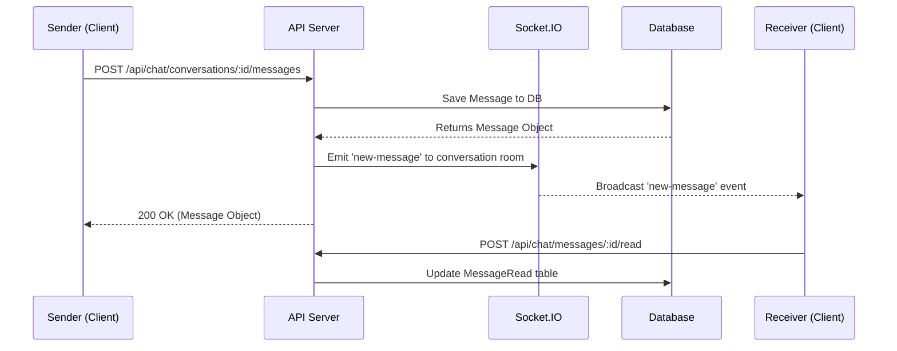

# Chat & Notifications Module

## Overview
The Chat & Notifications module in SSPL-TaskFlow provides real-time communication capabilities and system-wide alerts, ensuring users stay updated on task changes, assignments, and direct messages. It leverages Socket.IO for real-time bi-directional communication, enhancing team collaboration.

## Chat Features
*   **Real-time messaging:** Powered by Socket.IO for instant delivery.
*   **Conversations:** Supports Direct Messages (DM) and Group Conversations.
*   **Conversation List:** Displays all active chats with unread message indicators.
*   **Message Pagination:** Implements cursor-based pagination for efficient loading of historical messages.
*   **Read Receipts:** Tracks read status via the `MessageRead` table.
*   **Rich Interactions:** Includes Emoji picker support.
*   **Rich Text:** Messages can be formatted using CKEditor 5.
*   **Socket Events:** Emits and listens to `new-message` broadcasts within conversation rooms.

## Notification Features
*   **In-app Notifications:** Features a bell icon with an unread count badge.
*   **Real-time Delivery:** Notifications are pushed via Socket.IO.
*   **Status Management:** Users can mark individual notifications as read or "mark all as read".
*   **Notification Types:** 
    *   Task assignment
    *   User mention
    *   Upcoming/missed deadline
    *   System alerts
*   **Super Admin Notifications:** Dedicated notification stream for super administrators.
*   **Email Notifications:** Fallback and transactional emails sent via Nodemailer (e.g., invites, password resets, task assignments).

## System Architecture

### Backend Components
*   **Controllers:**
    *   `chat.js`: Handles `getConversations`, `getOrCreateDM`, `getMessages`, `sendMessage`, `getUnreadCounts`, `markRead`.
    *   `notificationController.js`: Manages `getNotifications`, `markAsRead`, `markAllAsRead`.
    *   `superAdminNotificationController.js`: Specialized controller for platform-wide admin alerts.
*   **Real-time Server:** Socket.IO server initialization is located in `server.js`, managing connections, rooms, and real-time event broadcasting.
*   **Services:**
    *   `emailService.js`: Encapsulates Nodemailer logic (`sendInviteEmail`, `sendPasswordResetEmail`, `sendNotificationEmail`).

### Frontend Components
*   **Pages & Components:**
    *   `ChatPage.jsx`: The comprehensive chat interface including the sidebar, message thread, and emoji picker.
    *   `Chat.jsx`: A reusable chat component for localized integration (e.g., within a task view).
    *   `NotificationBell.jsx`: The global header component displaying the bell icon and notification dropdown.
*   **State Management (Zustand):**
    *   `chatStore.js`: Manages Socket.IO connection state, active conversations, messages, and unread counts.
    *   `notificationStore.js`: Manages the notification list, unread count, and sets up socket listeners for incoming alerts.

## Database Schema

### Main Database
| Table | Fields | Description |
| :--- | :--- | :--- |
| `Notification` | `id`, `userId`, `title`, `message`, `type`, `link`, `isRead`, `readAt` | Stores system and user notifications. |

### Tenant Database
| Table | Fields | Description |
| :--- | :--- | :--- |
| `Conversation` | `id`, `type`, `name`, `createdAt`, `updatedAt` | Represents a DM or Group chat. |
| `ConversationParticipant` | `id`, `conversationId`, `userId`, `joinedAt` | Links users to conversations. |
| `Message` | `id`, `conversationId`, `senderId`, `content`, `createdAt` | Stores chat messages. |
| `MessageRead` | `id`, `messageId`, `userId`, `readAt` | Tracks which users have read specific messages. |

## API Endpoints

### Chat APIs
| Method | Endpoint | Description |
| :--- | :--- | :--- |
| GET | `/api/chat/conversations` | Get all conversations for the current user |
| POST | `/api/chat/conversations/dm` | Get or create a DM with another user |
| GET | `/api/chat/conversations/:id/messages` | Get messages for a conversation (paginated) |
| POST | `/api/chat/conversations/:id/messages` | Send a new message |
| GET | `/api/chat/unread-counts` | Get total unread message count |
| POST | `/api/chat/messages/:id/read` | Mark a message as read |

### Notification APIs
| Method | Endpoint | Description |
| :--- | :--- | :--- |
| GET | `/api/notifications` | Get user notifications |
| PUT | `/api/notifications/:id/read` | Mark specific notification as read |
| PUT | `/api/notifications/read-all` | Mark all notifications as read |

## Real-Time Message Flow

