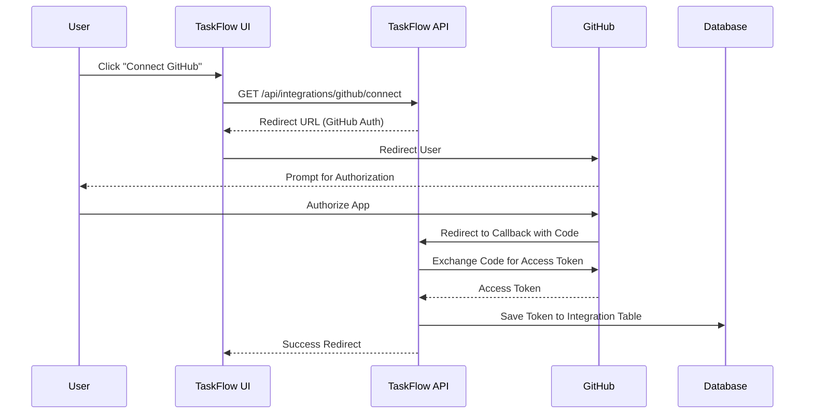
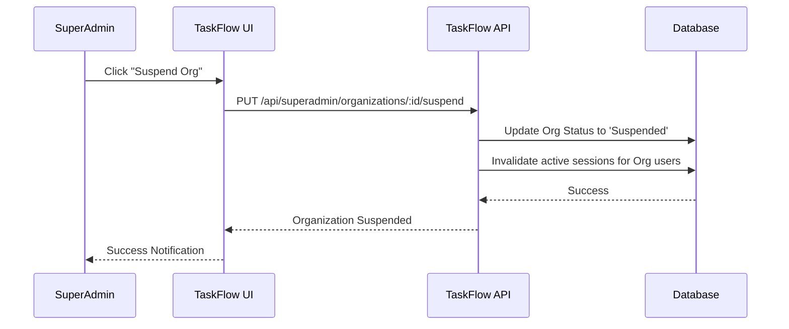

# Integrations & Super Admin Module

## Overview
The Integrations & Super Admin module encompasses two critical administrative areas: connecting SSPL-TaskFlow with third-party tools (like GitHub) and providing global platform oversight for super administrators. 

## GitHub Integration Features
*   **OAuth 2.0 Flow:** Secure authorization to connect GitHub accounts.
*   **Token Storage:** Access tokens are encrypted and stored in the `Integration` model.
*   **Repository Management:** List accessible GitHub repositories.
*   **Issue Tracking:** List and view GitHub issues directly within TaskFlow.
*   **Issue Import:** Seamlessly import GitHub issues as tasks within TaskFlow projects.
*   **Bi-directional Sync:** Synchronize task updates back to GitHub issues.
*   **SDK:** Powered by the `@octokit/rest` SDK for robust API interactions.

## Super Admin Panel Features
*   **Platform Dashboard:** High-level metrics including total organizations, total users, revenue, and plan distribution.
*   **Organization Management:** CRUD operations, suspend/activate organizations.
*   **Global User Management:** Manage users across all tenant organizations.
*   **User Impersonation:** Super admins can generate a JWT to log in as any user for troubleshooting purposes.
*   **System Health:** Monitoring of database connections, API latency, and server resources.
*   **Platform Settings:** Manage global variables and configurations.
*   **Support & Tickets:** Internal system to manage support requests from users.
*   **Billing Management:** Platform-wide oversight of invoices and subscriptions.

## Organization Management
*   **Organization Profile:** Manage `name`, `logo`, `theme`, `industry`, `size`, `website`, `country`, and `timezone`.
*   **Settings Configurations:** 
    *   `requireApproval`: Require admin approval for new users.
    *   `allowClientSignup`: Allow client/guest registration.
    *   `sessionTimeout`: Define auto-logout duration.
    *   `rolePermissions`: Custom RBAC overrides.
    *   `customFeatures`: Toggle specific features for the org.
*   **Insights:** Organization statistics and activity logs.
*   **Assets:** Logo upload and storage.

## System Architecture

### Backend Components
*   **Controllers:**
    *   `integrationController.js`: `connectGitHub`, `githubCallback`, `getIntegrations`, `disconnectIntegration`, `getGitHubRepos`, `getGitHubIssues`, `importGitHubIssues`, `syncGitHubIssues`.
    *   `superadminController.js`: `getAllOrganizations`, `getOrganizationById`, `updateOrganization`, `suspendOrganization`, `activateOrganization`, `deleteOrganization`, `getDashboard`, `getSystemHealth`, `getAllUsers`, `impersonateUser`.
    *   `organizationController.js`: `getOrganization`, `updateOrganization`, `getOrganizationStats`, `getOrganizationActivity`, `updateOrgSettings`, `getOrgSettings`, `uploadLogo`.

### Frontend Components
*   **Integrations:** 
    *   `Integrations.jsx`: UI for connecting/disconnecting GitHub, browsing repositories, and importing issues.
*   **Super Admin:** 
    *   9 specialized components: `Dashboard`, `OrganizationsList`, `OrganizationDetail`, `UsersList`, `SystemSettings`, `TicketManagement`, `BillingManagement`, `SuperAdminNotifications`.
*   **Organization Settings:**
    *   `Settings.jsx`: Tabbed interface for comprehensive organization configurations.

## Database Schema

### Main Database
| Table | Fields/Description |
| :--- | :--- |
| `Organization` | Core tenant entity holding profile and settings. |
| `Integration` | Stores third-party connections (e.g., `provider='github'`, `accessToken`, `organizationId`). |
| `PlatformSetting` | Global configurations accessible only to super admins. |

## API Endpoints

### Integration APIs
| Method | Endpoint | Description |
| :--- | :--- | :--- |
| GET | `/api/integrations/github/connect` | Initiate OAuth flow |
| GET | `/api/integrations/github/callback` | OAuth callback handler |
| GET | `/api/integrations/github/repos` | List connected repos |
| POST | `/api/integrations/github/import` | Import issues as tasks |

### Super Admin APIs
| Method | Endpoint | Description |
| :--- | :--- | :--- |
| GET | `/api/superadmin/dashboard` | Get platform metrics |
| GET | `/api/superadmin/organizations` | List all organizations |
| POST | `/api/superadmin/users/:id/impersonate`| Generate impersonation JWT |
| PUT | `/api/superadmin/organizations/:id/suspend`| Suspend an organization |

### Organization APIs
| Method | Endpoint | Description |
| :--- | :--- | :--- |
| GET | `/api/organizations/settings` | Get org settings |
| PUT | `/api/organizations/settings` | Update org settings |
| POST | `/api/organizations/logo` | Upload organization logo |

## Workflows

### GitHub OAuth Flow

### Super Admin Organization Suspension Flow

