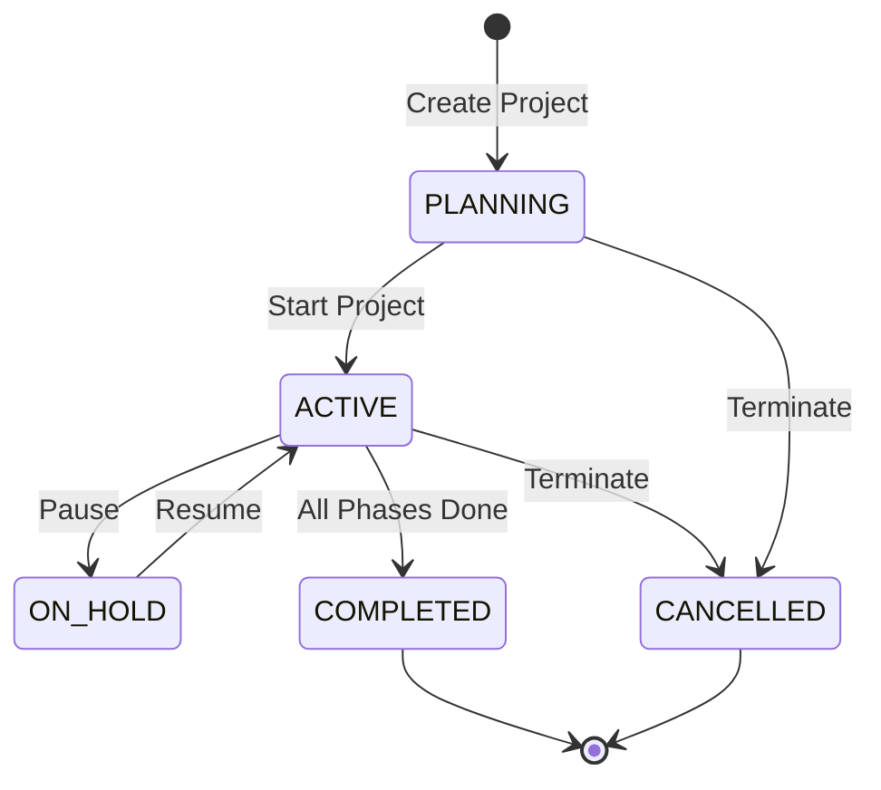

# Module: Project Management

## Purpose
Manages the multi-project lifecycle, including phased progression, budget tracking, team assignment, and visual dashboards for the SSPL-TaskFlow platform.

## Features
- **Project CRUD**: Full Create, Read, Update, Delete lifecycle for projects.
- **Phased Lifecycle**: Projects progress through 5 predefined phases (Planning, Design, Development, Testing, Deployment).
- **Phase Status Tracking**: Each phase tracks its status (`WAITING`, `IN_PROGRESS`, `COMPLETED`).
- **Budget Tracking**: Monitors total budget, used amount, remaining budget, and percentage utilization.
- **Team Management**: Project member assignment and role management.
- **Project Status**: Overall project state management (`PLANNING`, `ACTIVE`, `ON_HOLD`, `COMPLETED`, `CANCELLED`).
- **Dashboard Aggregation**: High-level data aggregation across projects.
- **Data Export**: Export project data in JSON or XLSX formats.
- **Presentation Mode**: Distraction-free mode for project reviews.
- **Reporting**: PDF and PNG exports generated via Puppeteer.

## Business Logic
- **Project Creation**: Creating a new project automatically provisions the 5 standard phases in sequential order.
- **Budget Alerts**:
  - **Green**: < 75% utilized
  - **Yellow**: 75% - 90% utilized
  - **Red**: > 90% utilized
- **Phase Completion**: A phase's completion status is dynamically calculated based on the completion of tasks assigned to that phase.
- **Dashboard Metrics**: Aggregates `totalTasks`, `completedTasks`, `overdueTasksCount`, `inProgressTasks`, `activeMembers`, and `daysToLaunch`.
- **Workload Distribution**: Calculated per team member based on active task assignments and estimated effort.

## User Flow & Data Architecture

### Project Lifecycle Flow


### Dashboard Data Flow
```mermaid
graph TD
    A[Tenant DB] --> B(Project Controller)
    A --> C(Task Controller)
    A --> D(Team Controller)
    B --> E{Dashboard Aggregator}
    C --> E
    D --> E
    E --> F[Dashboard.jsx (Frontend)]
```

## Frontend Components
- **ProjectsList.jsx**: Displays projects in grid or list view. Supports searching, filtering, creating via dialog, and importing from XLSX.
- **ProjectView.jsx**: Detailed view with tabs for Overview, Tasks, Team, Activity, and GitHub integration.
- **ProjectOverview.jsx**: Features a phase stepper, overview metric cards, and a visual budget tracker.
- **Dashboard.jsx**: Organization-level overview dashboard aggregating data across all active projects.

## Backend Services
- **projectController.js**: Handles `getProjects`, `getProject`, `createProject`, `updateProject`, `deleteProject`, `updatePhase`, `getProjectMembers`, `addProjectMember`, `removeProjectMember`, `exportProject`.
- **dashboardController.js**: Handles `getDashboard` data aggregation.
- **reportController.js**: Handles `exportPDF`, `exportPNG` using Puppeteer.
- **reportTemplate.js**: Utility to generate HTML templates for PDF/PNG rendering.

## Database Tables

### Tenant DB: `Project`
| Column | Type | Description |
|--------|------|-------------|
| id | String (UUID) | Primary Key |
| name | String | Project name |
| description | Text | Project details |
| status | Enum | PLANNING, ACTIVE, ON_HOLD, etc. |
| budgetTotal | Decimal | Total allocated budget |
| budgetUsed | Decimal | Amount spent so far |
| startDate | DateTime | Project start date |
| endDate | DateTime | Target completion date |
| createdAt | DateTime | Record creation timestamp |
| updatedAt | DateTime | Record update timestamp |

### Tenant DB: `Phase`
| Column | Type | Description |
|--------|------|-------------|
| id | String (UUID) | Primary Key |
| projectId | String | Foreign key to Project |
| name | String | Phase name (e.g., Design) |
| order | Integer | Sequential order (1-5) |
| status | Enum | WAITING, IN_PROGRESS, COMPLETED |

### Tenant DB: `ProjectMember`
| Column | Type | Description |
|--------|------|-------------|
| id | String (UUID) | Primary Key |
| projectId | String | Foreign key to Project |
| employeeId | String | Foreign key to Employee |
| role | String | Role within the project |

### Tenant DB: `Workload`
| Column | Type | Description |
|--------|------|-------------|
| id | String (UUID) | Primary Key |
| employeeId | String | Foreign key to Employee |
| assignedTasks | Integer | Number of active tasks |
| estimatedHours | Decimal | Total estimated effort |

## APIs Used

### Project Endpoints

| Method | Path | Description |
|--------|------|-------------|
| GET | `/api/projects` | List all projects |
| GET | `/api/projects/:id` | Get project details |
| POST | `/api/projects` | Create a new project |
| PUT | `/api/projects/:id` | Update project details |
| DELETE | `/api/projects/:id` | Delete a project |
| PUT | `/api/projects/:id/phases/:phaseId` | Update phase status |
| GET | `/api/projects/:id/members` | Get project team members |
| POST | `/api/projects/:id/members` | Add a member to project |
| DELETE | `/api/projects/:id/members/:memberId` | Remove member from project |
| GET | `/api/projects/:id/export` | Export project data |

### Dashboard & Reporting Endpoints

| Method | Path | Description |
|--------|------|-------------|
| GET | `/api/dashboard` | Get organization dashboard metrics |
| POST | `/api/reports/export-pdf` | Export dashboard/project to PDF |
| POST | `/api/reports/export-png` | Export dashboard/project to PNG |

#### Example: POST /api/projects
**Request:**
```json
{
  "name": "Website Redesign",
  "description": "Overhaul of the corporate website.",
  "budgetTotal": 15000,
  "startDate": "2026-08-01T00:00:00Z",
  "endDate": "2026-10-31T00:00:00Z"
}
```
**Response (201 Created):**
```json
{
  "success": true,
  "project": {
    "id": "proj-123",
    "name": "Website Redesign",
    "status": "PLANNING",
    "phases": [
      { "name": "Planning", "status": "WAITING", "order": 1 },
      { "name": "Design", "status": "WAITING", "order": 2 },
      { "name": "Development", "status": "WAITING", "order": 3 },
      { "name": "Testing", "status": "WAITING", "order": 4 },
      { "name": "Deployment", "status": "WAITING", "order": 5 }
    ]
  }
}
```
