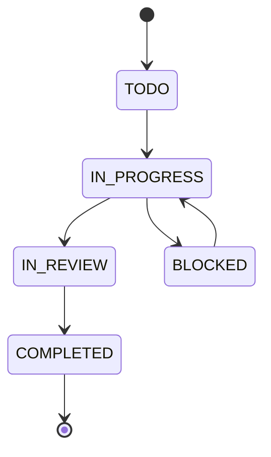
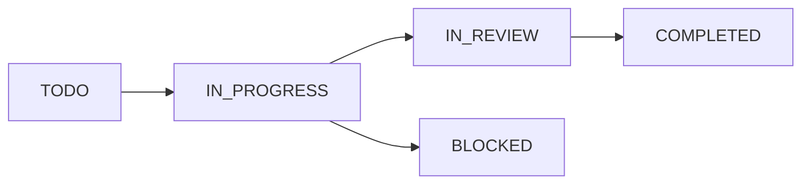
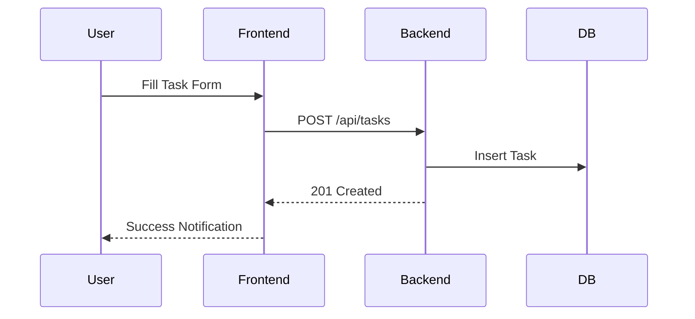

# Task Management Module

## 1. Purpose
Full task lifecycle management with subtasks, comments, attachments, Kanban board, and bulk operations.

## 2. Features
- Full CRUD for tasks with rich filtering (project, status, priority, assignee, phase, search, date range, tags)
- Task statuses: `TODO`, `IN_PROGRESS`, `IN_REVIEW`, `COMPLETED`, `BLOCKED`
- Task priorities: `LOW`, `MEDIUM`, `HIGH`, `URGENT`
- Completion percentage tracking (auto-set to 100% on COMPLETED)
- Subtask management (tasks with `parentId`)
- Task comments
- File attachments (multer upload)
- Tags for categorization
- Bulk update and bulk delete
- Task statistics per project
- Task activity log
- Kanban board with drag-and-drop (DnD Kit)
- Estimated vs actual hours

## 3. Business Logic
- Tasks belong to a project, optionally to a phase
- Assigned to an employee via `assignedTo` field
- Status transitions auto-update `completionPercentage` for COMPLETED
- Activity logs created on all changes
- Notifications sent to assigned users on create/update
- Overdue detection: past `dueDate` and status not COMPLETED
- Bulk operations restricted to ADMIN/MANAGER

## 4. Frontend Components
- **Tasks.jsx**: Global task list with filters, search, pagination, create/edit dialog, bulk actions, comments, attachments
- **Kanban.jsx / KanbanBoard.jsx / TaskKanban.jsx**: Drag-and-drop Kanban board with columns per status
- **TaskCard.jsx, TaskDetail.jsx, TaskFilters.jsx**: Task display components
- **TaskForm.jsx**: Create/edit task form
- **ImportTasksDialog.jsx**: XLSX import

## 5. Backend Services
- **taskController.js**: `getTasks`, `getTask`, `createTask`, `updateTask`, `deleteTask`, `bulkUpdateTasks`, `bulkDeleteTasks`, `getTaskStats`, `getTaskActivity`, `addTaskComment`, `getTaskComments`, `addSubtask`, `updateSubtask`, `deleteSubtask`, `getSubtasks`, `addTaskAttachment`, `getTaskAttachments`, `deleteTaskAttachment`

## 6. Database Tables (Tenant DB)
| Table | Columns |
|-------|---------|
| **Task** | id, projectId, phaseId, title, description, status, priority, completionPercentage, dueDate, assignedTo, tags (Json), parentId, estimatedHours, actualHours, createdAt, updatedAt |
| **TaskComment** | id, taskId, employeeId, content, createdAt |
| **TaskAttachment** | id, taskId, filename, originalName, mimeType, size, url, uploadedBy, createdAt |

## 7. APIs

| Method | Endpoint | Description |
|--------|----------|-------------|
| GET | `/api/tasks` | Get all tasks |
| GET | `/api/tasks/:id` | Get task by ID |
| POST | `/api/tasks` | Create task |
| PUT | `/api/tasks/:id` | Update task |
| DELETE | `/api/tasks/:id` | Delete task |
| POST | `/api/tasks/bulk-update` | Bulk update tasks |
| POST | `/api/tasks/bulk-delete` | Bulk delete tasks |
| GET | `/api/tasks/:id/stats` | Get task stats |
| GET | `/api/tasks/:id/activity` | Get task activity |
| POST | `/api/tasks/:id/comments` | Add task comment |
| GET | `/api/tasks/:id/comments` | Get task comments |
| POST | `/api/tasks/:id/subtasks` | Add subtask |
| PUT | `/api/tasks/:id/subtasks/:subId` | Update subtask |
| DELETE | `/api/tasks/:id/subtasks/:subId`| Delete subtask |
| GET | `/api/tasks/:id/subtasks` | Get subtasks |
| POST | `/api/tasks/:id/attachments` | Add attachment |
| GET | `/api/tasks/:id/attachments` | Get attachments |
| DELETE | `/api/tasks/:id/attachments/:attId`| Delete attachment |

### Example: Create Task
```json
// POST /api/tasks
{
  "title": "Setup DB",
  "projectId": "proj-123",
  "status": "TODO",
  "priority": "HIGH"
}
```

## 8. Mermaid Diagrams

### Task Lifecycle Flow


### Kanban Board Columns


### Task Creation Flow

