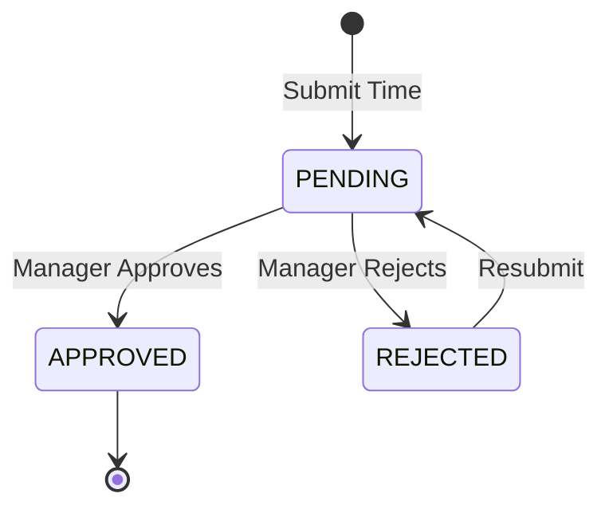
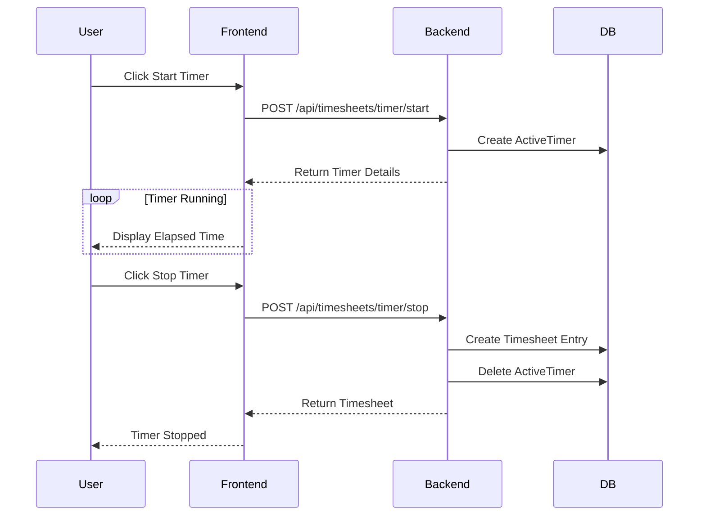

# Timesheet & Performance Module

## 1. Timesheet Features
- Manual time entry (hours, date, project, task, description)
- Timer-based tracking (start/stop with GlobalTimer widget)
- ActiveTimer model for tracking running timers
- Approval workflow: PENDING → APPROVED / REJECTED
- Manager/Admin can approve/reject/bulk-approve
- Timesheet summary (daily/weekly/monthly totals)
- Timesheet report generation
- XLSX export

## 2. Performance Features
- Team performance metrics: completion rate, on-time delivery, avg completion time, overdue rate
- Individual member performance
- Performance trends over time (6-month)
- KPIs by project
- Task distribution by priority
- Velocity metrics

## 3. Backend Services
- **timesheetController.js**: `getTimesheets`, `createTimesheet`, `updateTimesheet`, `deleteTimesheet`, `startTimer`, `stopTimer`, `getActiveTimer`, `getTimesheetSummary`, `approveTimesheet`, `rejectTimesheet`, `bulkApprove`, `getTimesheetReport`, `exportTimesheets`
- **performanceController.js**: `getTeamPerformance`, `getMemberPerformance`, `getPerformanceTrends`

## 4. Frontend Components
- **Timesheets.jsx** (129KB): Full timesheet management, manual entry, timer, approval, summary, export
- **Performance.jsx**: KPI cards, charts, trends, member breakdown
- **GlobalTimer.jsx**: Persistent header timer widget
- **TimerWidget.jsx**: Compact timer display
- **timerStore.js**: Timer state management

## 5. Database Tables

| Table | Columns |
|-------|---------|
| **Timesheet** | id, employeeId, projectId, taskId, date, hours, description, status (PENDING/APPROVED/REJECTED), approvedBy, approvedAt |
| **ActiveTimer** | id, employeeId, taskId, projectId, taskTitle, startTime (unique per employee) |
| **Worklog** | id, taskId, employeeId, hours, description, date |
| **Workload** | id, employeeId, projectId, taskCount, completedTasks, workloadPercentage |

## 6. APIs

### Timesheet APIs
| Method | Endpoint | Description |
|--------|----------|-------------|
| GET | `/api/timesheets` | Get timesheets |
| POST | `/api/timesheets` | Create timesheet |
| PUT | `/api/timesheets/:id` | Update timesheet |
| DELETE | `/api/timesheets/:id` | Delete timesheet |
| POST | `/api/timesheets/timer/start` | Start timer |
| POST | `/api/timesheets/timer/stop` | Stop timer |
| GET | `/api/timesheets/timer/active` | Get active timer |
| GET | `/api/timesheets/summary` | Get summary |
| POST | `/api/timesheets/:id/approve` | Approve timesheet |
| POST | `/api/timesheets/:id/reject` | Reject timesheet |
| POST | `/api/timesheets/bulk-approve` | Bulk approve timesheets |
| GET | `/api/timesheets/report` | Get timesheet report |
| GET | `/api/timesheets/export` | Export to XLSX |

### Performance APIs
| Method | Endpoint | Description |
|--------|----------|-------------|
| GET | `/api/performance/team` | Get team performance |
| GET | `/api/performance/members/:id` | Get member performance |
| GET | `/api/performance/trends` | Get performance trends |

### Example: Start Timer
```json
// POST /api/timesheets/timer/start
{
  "taskId": "task-123",
  "projectId": "proj-456"
}
```

## 7. Mermaid Diagrams

### Timesheet Workflow


### Timer Flow

